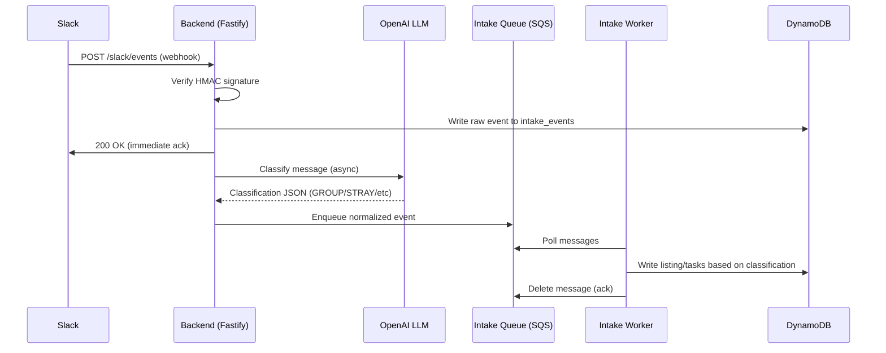
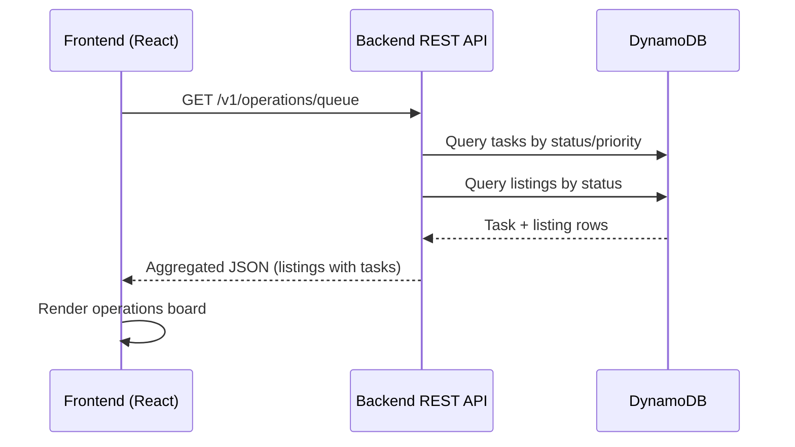
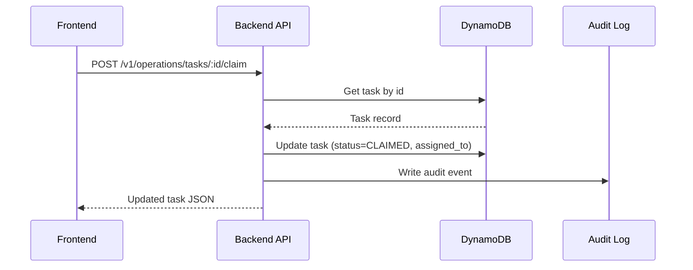

# ArchieOS Backend — Current State Dossier

**Date:** October 5, 2025  
**Branch:** Noahs-agetnic-experiment  
**Purpose:** Discovery-only documentation of what exists today

---

## 1. Executive Snapshot

### What Exists Today

ArchieOS Backend is a **Node.js 20 + TypeScript operations center** for real estate task management with Slack integration. The system ingests Slack events, classifies them via LLM (OpenAI), and writes structured listings and tasks to DynamoDB. A React frontend (`packages/frontend`) displays task queues, listings, and operations boards.

**Key Technologies:**
- Backend: Node.js 20, Fastify, TypeScript, DynamoDB (via `@aws-sdk/lib-dynamodb`)
- Frontend: React, Vite, TypeScript
- Infrastructure: LocalStack (local), AWS (target), Docker Compose
- LLM: OpenAI API (`gpt-4.1-mini` default) for Slack message classification
- Queueing: AWS SQS with DLQ for intake pipeline

**Agent Status:**
- **Archie** (user-facing) and **Lauren** (executor): **Not implemented**. Referenced in documentation only.
- **OpenAI Agents Python SDK:** Present in `/external/openai-agents-python/` as a reference but **not integrated into application code**.
- Current "agent" behavior: Simple LLM-based classification service (`src/services/llmClassifier.ts`) that categorizes Slack messages into task types.

**Matrix Integration:**
- **Not present** in codebase. Mentioned in frontend documentation (`packages/frontend/docs/tasks/admin-platform-responsibilities.md`) as planned feature for "mirroring events to Matrix (Synapse)" but no implementation exists.
- No Synapse container in `docker-compose.yml`.
- No Matrix SDK dependencies in `package.json`.

---

## 2. SDK Capability Map

### OpenAI Agents Python SDK Location

| Item | Path | Status |
|------|------|--------|
| SDK Source | `/external/openai-agents-python/` | Present (git submodule) |
| SDK Version | Not specified | From git, appears recent |
| Integration Status | **None** | SDK is reference material only |
| Python Runtime | None configured | Node.js-only application |

### SDK Capabilities vs. Current Use

| SDK Feature | SDK Path/Docs | Current Application Use |
|-------------|---------------|-------------------------|
| Agent Definition | `src/agents/agent.py` | ❌ Not used |
| Runner (sync/async) | `src/agents/run.py` | ❌ Not used |
| Function Tools | `src/agents/tool.py` | ❌ Not used |
| Handoffs | `docs/handoffs.md` | ❌ Not used |
| Sessions | `docs/sessions.md` | ❌ Not used |
| Tracing | `docs/tracing.md` | ❌ Not used |
| MCP Servers | `docs/mcp.md` | ❌ Not used |
| Guardrails | `docs/guardrails.md` | ❌ Not used |

### Current LLM Integration

**File:** `src/services/llmClassifier.ts`

**Approach:** Direct OpenAI API calls (via `openai` npm package v4.56.0) for message classification, not using Agents SDK.

**Functionality:**
- Extracts text from Slack event payloads
- Builds prompt with system instructions + few-shot examples
- Calls OpenAI Structured Outputs (JSON schema enforcement)
- Classifies messages as: `GROUP`, `STRAY`, `INFO_REQUEST`, or `IGNORE`
- Returns structured task metadata (task_key, group_key, listing info, confidence)

---

## 3. Agents & Tools Inventory

### Archie (User-Facing Agent)

**Status:** ❌ **Not implemented**

**Documentation References:**
- `packages/frontend/docs/tasks/admin-platform-responsibilities.md`: Describes Archie as "the platform" that "understands context," "catches intent," and "speaks human."
- No Python agent definition file found.
- No tool registration found.
- No database read capability for "how are tasks going?" implemented.

**Expected Capabilities (per docs):**
- Natural language task creation from user messages
- Context awareness (clients, properties, statuses)
- Playbook triggering (listing checklists)
- Status updates back to agents via SMS/iMessage

**Actual Implementation:** None. User interaction is via frontend UI or Slack → LLM classifier → database writes.

### Lauren (Executor Agent)

**Status:** ❌ **Not implemented**

**Documentation References:** None found beyond high-level concept.

**Expected Capabilities (per docs):**
- Task execution
- Database writes for task CRUD
- Handoff from Archie

**Actual Implementation:** None. Task CRUD happens via REST API routes (`src/routes/tasks.ts`).

### Current "Agent" Behavior

The system's autonomous behavior is limited to:
1. **LLM Classification** (`src/services/llmClassifier.ts`):
   - Input: Slack message text
   - Output: Structured classification (GROUP/STRAY/INFO_REQUEST/IGNORE)
   - No tool calling, no multi-step reasoning, no handoffs
2. **Intake Worker** (`scripts/intake-worker.ts`):
   - Polls SQS queue
   - Writes classified events to DynamoDB
   - No agent orchestration

### Tool Inventory

**No agent tools exist.** The system exposes REST APIs, not agent-callable tools.

**REST API Endpoints** (would need wrapping as tools):

| Endpoint | Purpose | DB Access |
|----------|---------|-----------|
| `GET /v1/operations/listings` | List listings | Read |
| `GET /v1/operations/listings/:id` | Get listing details | Read |
| `GET /v1/operations/tasks/:listingId` | Get tasks for listing | Read |
| `POST /v1/operations/tasks/:taskId/claim` | Claim task | Write |
| `POST /v1/operations/tasks/:taskId/complete` | Complete task | Write |
| `GET /v1/operations/my-tasks` | Get user's claimed tasks | Read |
| `GET /v1/operations/queue` | Get global task queue | Read |

**Gap:** No tool interface exists for Archie to read "how are tasks going?" Current UI queries via REST endpoints.

---

## 4. Data & Flows

### Database Overview

**Engine:** DynamoDB (AWS) / LocalStack (local development)

**Not Postgres:** Documentation mentions "Postgres + pgvector" (`packages/frontend/docs/tasks/admin-platform-responsibilities.md:34`) but implementation uses DynamoDB exclusively.

**Tables:**

| Table | PK | SK/GSIs | Purpose |
|-------|----|---------|---------| 
| `entities` | `entity_key` | TypeStatusIndex | Users, agents, admins, clients |
| `listings` | `listing_id` | StatusIndex, AgentIndex, TypeDueDateIndex, AddressSearchIndex, CreatedAtIndex | Real estate listings (SALE/LEASE) |
| `tasks` | `task_id` | MyTasksIndex, QueueIndex, ListingTasksIndex, StatusIndex, UnclaimedTasksIndex, TaskCategoryIndex | Tasks (listing-scoped or stray) |
| `audit_log` | `entity_id`, `sk` | UserActivityIndex, EntityTypeIndex, ListingHistoryIndex | Audit trail for all mutations |
| `intake_events` | `event_id` | (none) | Raw Slack events before processing |

**Schemas:** Defined in TypeScript interfaces in `src/db/*.ts` files.

**Matrix Schema:** ❌ Not present. No shared database namespace for Matrix homeserver.

### Current Data Flows

#### Slack Inbound → Task Creation



#### Frontend → Task Queue Read



#### Task Lifecycle (Claim/Complete)



### Matrix Integration Flow (Planned, Not Implemented)

**Gap:** No message ingestion from Matrix, no outbound messaging to Matrix, no shared database views.

Expected (per docs):
```
Matrix Room → (missing adapter) → System Event Bus → (missing) Archie Agent → (missing) Outbound Matrix Message
```

Actual: None.

---

## 5. Database Schema Detail

### entities

```typescript
{
  entity_key: string;        // PK: "slack:U123" or "email:foo@bar"
  entity_id: string;         // ULID
  type: string;              // AGENT, ADMIN_OPS, ADMIN_MARKETING, CLIENT
  name?: string;
  email?: string;
  slack_user_id?: string;
  role_subtype?: string;
  status: string;
  created_at: string;        // ISO timestamp
  updated_at: string;
  metadata?: Record<string, unknown>;
  external_ids?: Record<string, string>;
}
```

**GSI:** TypeStatusIndex (PK=type, SK=status#updated_at)

### listings

```typescript
{
  listing_id: string;        // PK: ULID
  type: "SALE" | "LEASE";
  address?: Address;         // { line1, city, state, postal_code, country }
  address_string?: string;   // For search
  agent_id?: string;
  assignee?: string;
  status: string;            // NEW, IN_PROGRESS, LIVE, DONE_POSTED, ARCHIVED
  property_type?: string;
  due_date?: string;
  task_template_version?: number;
  created_at: string;
  updated_at: string;
  completed_at?: string;
  // ... property details (bedrooms, bathrooms, sqft, price, etc.)
}
```

**GSIs:**
- StatusIndex (PK=status, SK=due_date)
- AgentIndex (PK=agent_id, SK=due_date)
- TypeDueDateIndex (PK=type, SK=due_date)
- AddressSearchIndex (PK=GLOBAL, SK=address_string)
- CreatedAtIndex (PK=GLOBAL, SK=created_at)

### tasks

```typescript
{
  task_id: string;           // PK: ULID
  listing_id?: string;
  task_def_id?: string;      // References task catalog
  name: string;
  description?: string;
  status: string;            // NEW, OPEN, CLAIMED, IN_PROGRESS, BLOCKED, DONE, CANCELED
  priority?: number;
  assigned_to?: { userId, username?, email? };
  claim_status?: string;     // CLAIMED, UNCLAIMED
  due_date?: string;
  completed_at?: string;
  completed_by?: string;
  inputs?: Record<string, unknown>;
  outputs?: Record<string, unknown>;
  created_at: string;
  updated_at: string;
  is_stray?: boolean;        // True for non-listing tasks
}
```

**GSIs:**
- MyTasksIndex (PK=assigned_to.userId, SK=due_date)
- QueueIndex (PK=listing_id#status, SK=priority#due_date)
- ListingTasksIndex (PK=listing_id, SK=status#priority)
- StatusIndex (PK=listing_id, SK=status)
- UnclaimedTasksIndex (PK=listing_id, SK=claim_status)
- TaskCategoryIndex (PK=task_category#is_stray, SK=created_at)

### audit_log

```typescript
{
  entity_id: string;         // PK: listing_id or task_id
  sk: string;                // SK: timestamp#event_id
  entity_type: string;       // listing, task, entity
  event_id: string;          // ULID
  timestamp: string;         // ISO
  action: string;            // created, updated, claimed, completed, etc.
  performed_by?: string;     // User ID
  changes?: Record<string, unknown>;
  content?: string;
  metadata?: Record<string, unknown>;
}
```

**GSIs:**
- UserActivityIndex (PK=performed_by, SK=timestamp)
- EntityTypeIndex (PK=entity_type#action, SK=timestamp)
- ListingHistoryIndex (PK=entity_type#entity_id, SK=timestamp)

### Access Patterns Summary

| Pattern | Agent | Route/Service | Read/Write | Table + Index |
|---------|-------|---------------|------------|---------------|
| List all open tasks | UI | `GET /v1/operations/queue` | Read | tasks (QueueIndex) |
| Get my assigned tasks | UI | `GET /v1/operations/my-tasks` | Read | tasks (MyTasksIndex) |
| Get tasks for listing | UI | `GET /v1/operations/tasks/:listingId` | Read | tasks (ListingTasksIndex) |
| Claim task | UI | `POST /tasks/:id/claim` | Write | tasks (PK), audit_log |
| Complete task | UI | `POST /tasks/:id/complete` | Write | tasks (PK), audit_log |
| Create listing from Slack | Worker | `intakeIngestor.ts` | Write | listings (PK), tasks (PK) |
| Audit user activity | (future) | audit_log (UserActivityIndex) | Read | audit_log |

**Archie DB-Read Tool:** ❌ **Not implemented**. No tool interface exists for agent to query task status programmatically.

---

## 6. API Surfaces & Contracts

### Current REST API

**Base URL:** `/v1/operations` (all routes prefixed)

**Authentication:**
- Plugin: `src/plugins/auth.ts` (JWT/OIDC/Cognito)
- Debug mode: `X-Debug-User` header bypasses auth in local env

**Key Endpoints:**

| Method | Path | Request | Response | Notes |
|--------|------|---------|----------|-------|
| GET | `/listings` | Query params (status, agent_id) | `{ listings: Listing[] }` | Paginated |
| GET | `/listings/:id` | - | `{ listing: Listing }` | Single |
| GET | `/listings/:id/details` | - | `{ listing, tasks, notes, attachments }` | Aggregated |
| GET | `/tasks/:listingId` | - | `{ tasks: Task[] }` | For listing |
| GET | `/tasks/task/:taskId` | - | `{ task: Task }` | Single |
| POST | `/tasks/:taskId/claim` | `{ userId }` | `{ task: Task }` | Sets assigned_to |
| POST | `/tasks/:taskId/unclaim` | `{ reason? }` | `{ task: Task }` | Clears assigned_to |
| POST | `/tasks/:taskId/complete` | `{ userId, outputs? }` | `{ task: Task }` | Sets status=DONE |
| GET | `/my-tasks` | Query: `userId` | `{ listings: [...], strays: [...] }` | User's work |
| GET | `/queue` | Query params (status, priority) | `{ listings: [...] }` | Global queue |
| GET | `/stray-queues` | - | `{ adminQueue, marketingQueue }` | Non-listing tasks |
| GET | `/board` | - | `{ byStatus: {...} }` | Kanban view |
| POST | `/slack/events` | Slack event JSON | `{ ok: true }` | Webhook |
| POST | `/slack/interact` | Slack interaction JSON | varies | Buttons/shortcuts |
| GET | `/entities` | Query: `type`, `status` | `{ entities: Entity[] }` | Users/agents |
| POST | `/files/sign-get` | `{ key }` | `{ url, expiresIn }` | Presigned S3 URL |

**Payload Shapes:**

**Listing:**
```json
{
  "listingId": "01HXYZ...",
  "type": "SALE",
  "address": { "line1": "123 Main St", "city": "Toronto", "state": "ON" },
  "status": "IN_PROGRESS",
  "agentId": "agent:emma",
  "dueDate": "2025-10-20T00:00:00Z",
  "createdAt": "2025-10-05T12:00:00Z"
}
```

**Task:**
```json
{
  "taskId": "01HXYZ...",
  "listingId": "01HXYZ...",
  "name": "Book Photos",
  "status": "OPEN",
  "priority": 1,
  "dueDate": "2025-10-08T00:00:00Z",
  "assignedTo": null,
  "canClaim": true,
  "inputs": { "availability": "Mon-Fri 9-5" },
  "outputs": null
}
```

**Provenance Fields:**

| Field | Usage |
|-------|-------|
| `created_by` | User/agent ID who created entity |
| `performed_by` | In audit_log, who performed action |
| `trace_id` | In Slack intake, original Slack client_msg_id |
| `x-correlation-id` | HTTP header, propagated to all log entries |

**Correlation/Parent IDs:**
- Tasks have optional `listing_id` (parent)
- Audit events have `entity_id` (parent entity)
- No explicit conversation/thread tracking beyond Slack `ts` (timestamp)

### OpenAPI Spec

**File:** `src/openapi.ts`

**Generation:** Manual schema definitions in code, exposed at `GET /openapi.json`

**Documentation UI:** `GET /docs` (Swagger UI, behind `ENABLE_DOCS` flag)

### Agent-to-Agent Messages

**Status:** ❌ Not applicable. No agent orchestration exists.

**Expected (if using SDK):** Handoff messages between Archie and Lauren would use SDK's handoff mechanism (see `external/openai-agents-python/docs/handoffs.md`).

---

## 7. Configuration & Secrets

### Environment Variables

**File:** `ENV_LOCAL_EXAMPLE.txt` (template), `.env` (local instance)

**Key Variables:**

| Variable | Purpose | Default (Local) |
|----------|---------|----------------|
| `AWS_REGION` | AWS region | `us-east-1` |
| `LOCALSTACK_ENDPOINT` | LocalStack URL | `http://localhost:4566` |
| `PORT` | Backend server port | `3000` |
| `ENTITIES_TABLE` | DynamoDB table name | `entities` |
| `LISTINGS_TABLE` | DynamoDB table name | `listings` |
| `TASKS_TABLE` | DynamoDB table name | `tasks` |
| `AUDIT_LOG_TABLE` | DynamoDB table name | `audit_log` |
| `ARTIFACTS_BUCKET` | S3 bucket for files | `archieos-artifacts` |
| `INTAKE_QUEUE_URL` | SQS queue URL | `http://localhost:4566/.../intake-queue` |
| `INTAKE_EVENTS_TABLE` | DynamoDB table name | `intake_events` |
| `USE_LLM_CLASSIFIER` | Feature flag for LLM | `false` (default off) |
| `LLM_PROVIDER` | Provider name | `openai` |
| `OPENAI_API_KEY` | OpenAI API key | (required if LLM enabled) |
| `OPENAI_MODEL` | Model name | `gpt-4.1-mini` |
| `LLM_CONFIDENCE_MIN` | Min confidence threshold | `0.6` |
| `LLM_TIMEOUT_MS` | LLM request timeout | `6000` |
| `CORS_ORIGINS` | Allowed origins | `http://localhost:5173,...` |
| `ALLOW_DEBUG_USER` | Debug auth bypass | `true` (local only) |
| `SLACK_SIGNING_SECRET` | Slack webhook verification | (required) |

### Model Selection

**Current:** `gpt-4.1-mini` (OpenAI)

**Configuration:** `OPENAI_MODEL` env var in `llmClassifier.ts`

**SDK Model:** Not used. If agents were implemented, would configure via `Agent({ model: "gpt-4.1" })`.

### Timeouts & Retries

| Setting | Value | Location |
|---------|-------|----------|
| LLM timeout | `6000ms` | `LLM_TIMEOUT_MS` |
| LLM max retries | `2` | `LLM_MAX_RETRIES` |
| SQS visibility timeout | (default 30s) | AWS SQS config |
| SQS max receive count | `5` (then to DLQ) | `scripts/infra-init.ts:213` |

---

## 8. Infrastructure & Operations

### AWS Resources (Target Production)

**Compute:**
- Planned: Lambda functions or ECS tasks (not yet provisioned)
- Current: Node.js process on EC2 or similar

**Database:**
- DynamoDB tables (5 tables, see section 5)
- Provisioned throughput: 1 RCU/1 WCU per table (LocalStack), on-demand (prod)

**Storage:**
- S3 bucket: `archieos-artifacts` (documents, attachments)

**Queueing:**
- SQS: `intake-queue` (main) + `intake-queue-dlq` (dead-letter)

**Monitoring:**
- CloudWatch: Alarms for queue age, DLQ depth (configured in `infra-init.ts:229-257`)
- Dashboard: Basic SQS metrics widget (created in `infra-init.ts:259-283`)

**CDN:**
- CloudFront: Planned for signed URLs (`USE_CLOUDFRONT` flag) but not required

**Auth:**
- Cognito or OIDC: Configured via `OIDC_ISSUER`, `COGNITO_ISSUER` env vars

**Secrets:**
- Planned: AWS Secrets Manager
- Current: Environment variables in `.env`

### Local Docker Setup

**File:** `docker-compose.yml`, `docker-compose.dev.yml`

**Services:**

| Service | Image | Ports | Purpose |
|---------|-------|-------|---------|
| `localstack` | `localstack/localstack:3` | `4566:4566` | Mock AWS services (DynamoDB, S3, SQS, CloudWatch) |
| `backend` | `node:20-alpine` | `3000:3000` | Fastify API server (dev mode only) |
| `frontend` | `node:20-alpine` | `5173:5173` | Vite dev server (dev mode only) |

**Matrix Service:** ❌ Not present

**Parity:** Local uses LocalStack; prod uses real AWS. Tables/queues created via `scripts/infra-init.ts`.

### Deployment Scripts

| Script | Purpose | Invocation |
|--------|---------|------------|
| `infra:init` | Provision DynamoDB/S3/SQS in LocalStack | `npm run infra:init` |
| `infra:verify` | Check infrastructure health | `npm run infra:verify` |
| `seed` | Insert sample listings/tasks | `npm run seed` |
| `start:local` | Orchestrated local startup | `./scripts/start-local.sh` |

**IaC:** ❌ Not present. No Terraform or CDK definitions found. Manual provisioning via SDK scripts.

---

## 9. Observability

### Logging

**Format:** JSON-structured logs via Fastify's Pino logger

**Log Levels:** Configurable via `LOG_LEVEL` (default: `debug` local, `info` prod)

**Correlation IDs:** 
- `x-correlation-id` header injected into all requests (`src/app.ts:55-58`)
- Propagated to all log entries and error responses

**Verbose HTTP Logging:**
- Enabled via `HTTP_LOG_VERBOSE=true`
- Logs request/response details (headers, body preview, timing) in `src/app.ts:109-160`

**Log Sinks:**
- Stdout (captured by Docker/systemd)
- Local files: `/tmp/backend.log`, `/tmp/frontend.log` (when using `start-local.sh`)

### Traces

**X-Ray:** 
- Plugin imported: `src/services/xray.ts`
- Status: ❌ Not fully enabled. Capturable with `captureAsync()` helper but no active traces observed.

**OpenAI Agents SDK Tracing:**
- ❌ Not applicable (SDK not integrated)
- If implemented, would use Traces API at platform.openai.com/traces

### Metrics

**Plugin:** `src/plugins/metrics.ts`

**Exposed Metrics:**
- `http_requests_total` (counter, by method/path)
- `http_request_duration_seconds` (histogram)

**Endpoint:** `GET /metrics` (Prometheus format)

**CloudWatch:**
- Alarms configured for SQS metrics (`infra-init.ts:229-257`)
- Dashboard: `OpsCenter` (SQS queue depth, oldest message age)

### Dashboards

**Current:**
- Basic CloudWatch dashboard with SQS widgets (defined in code)
- No Grafana or external dashboards

**Where to Find:**
- LocalStack: Mock metrics (not persisted)
- AWS Console: CloudWatch → Dashboards → `OpsCenter`

---

## 10. Tests & Fixtures

### Test Framework

**Tool:** Vitest (v1.6.0)

**Location:** `tests/` directory (25 test files)

**Running Tests:**
```bash
npm test           # Run all
npm run test:watch # Watch mode
npm run e2e        # E2E flow only
```

### Coverage Inventory

| Test File | Focus | Coverage |
|-----------|-------|----------|
| `auth.routes.test.ts` | Auth endpoints | Unit |
| `board.routes.test.ts` | Operations board API | Integration |
| `e2e.flow.test.ts` | Full flow: seed → claim → complete → queue | E2E |
| `entities.routes.test.ts` | Entities CRUD | Integration |
| `files.routes.test.ts` | File presigning | Integration |
| `listings.routes.test.ts` | Listings API | Integration |
| `listings.ddb.test.ts` | DynamoDB listings operations | Unit |
| `tasks.routes.test.ts` | Tasks API (claim/complete/unclaim) | Integration |
| `tasks.ddb.test.ts` | DynamoDB tasks operations | Unit |
| `llmClassifier.test.ts` | LLM classification logic | Unit |
| `intake.pipeline.test.ts` | Slack → queue → DB flow | Integration |
| `slack.routes.test.ts` | Slack webhook handling | Integration |
| `taskCatalog.test.ts` | Task definition loading | Unit |

### Fixtures

**Task Definition:**
- `config/task-definitions/SALE::BOOK_PHOTOS@v1.json`
- JSON schema for task inputs/outputs
- Loaded by `taskCatalog.ts` on boot

**Matrix Events:** ❌ Not present

**Agent Conversations:** ❌ Not present (no agent implementations)

**Slack Event Fixtures:** Embedded in `slack.routes.test.ts` and `llmClassifier.test.ts` (inline JSON payloads)

### Golden Transcripts / Replay Tools

**Status:** ❌ Not present

**Gap:** No saved agent conversation transcripts or replay mechanisms.

---

## 11. Constraints, Assumptions, Unknowns

### Hard Constraints (Observed in Code)

1. **Node.js 20 only:** `package.json` specifies `"engines": { "node": ">=20 <21" }`
2. **DynamoDB single-table per entity:** No joins; queries via GSIs only
3. **Slack signature required:** `src/services/slackVerify.ts` validates HMAC; bypass via `SLACK_BYPASS_VERIFY=true` (local only)
4. **LLM confidence threshold:** Messages below `LLM_CONFIDENCE_MIN` (default 0.6) fall back to legacy classifier
5. **SQS message visibility:** 30 seconds (AWS default), no explicit override
6. **LocalStack dependency:** Local dev requires Docker and LocalStack running

### Assumptions (Derived from Docs/Code)

1. **Single AWS account:** No multi-account or cross-region setup observed
2. **Synchronous intake processing:** Worker polls SQS sequentially; no parallelism configured
3. **Frontend trust:** Debug mode allows header-based auth bypass (`X-Debug-User`)
4. **Task catalog is static:** JSON files in Git; no dynamic catalog editing UI
5. **Slack is primary ingestion channel:** No other message sources integrated (email, Matrix)

### Unknowns (Gaps/Ambiguities)

1. **Archie/Lauren implementation timeline:** No code exists; unclear if in development elsewhere
2. **Matrix homeserver setup:** Docs reference "shared database instance" but no schema or container defined
3. **Production deployment:** No IaC (CDK/Terraform); unclear how AWS resources are provisioned for prod
4. **Agent orchestration model:** If agents are added, will they run in:
   - Separate Python service?
   - Lambda functions?
   - ECS tasks?
5. **Agent tool permissions:** No RBAC/ACL defined for tools (if implemented)
6. **Agent rate limits:** No rate limiting on hypothetical agent→LLM calls
7. **Matrix message format:** No schema defined for bidirectional Matrix↔System messages
8. **Agent DB read tool interface:** If Archie needs "how are tasks going?" capability:
   - Direct SQL/DynamoDB access?
   - REST API wrapper as tool?
   - Custom MCP server?
9. **Concurrency limits:** SQS worker processes one message at a time; no scaling config
10. **Secrets rotation:** No automated secret rotation observed (Slack, OpenAI keys)

### Clarifications Needed

- **Matrix integration approach:** Will Matrix be event-driven (webhook) or polling (client SDK)?
- **Agent runtime:** Python service or embed SDK in Node.js (via child process)?
- **Task status tool:** Should agent query DynamoDB directly or via REST API?
- **Handoff triggers:** What conditions cause Archie→Lauren handoff?
- **Session management:** How are agent conversations persisted (SDK sessions vs. custom)?

---

## Appendices

### A. File Structure

```
/Users/noahdeskin/ArchieOS Backend.worktrees/Noahs-agetnic-experiment/
├── external/
│   └── openai-agents-python/     # Git submodule (SDK reference, not integrated)
├── packages/
│   └── frontend/                 # React frontend (Vite, TypeScript)
├── src/
│   ├── app.ts                    # Fastify server entrypoint
│   ├── db/
│   │   ├── client.ts             # DynamoDB client
│   │   ├── entities.ts           # Entities table operations
│   │   ├── listings.ts           # Listings table operations
│   │   ├── tasks.ts              # Tasks table operations
│   │   └── audit_log.ts          # Audit log operations
│   ├── routes/
│   │   ├── slack.ts              # Slack webhook handlers
│   │   ├── listings.ts           # Listings REST API
│   │   ├── tasks.ts              # Tasks REST API
│   │   ├── board.ts              # Operations board API
│   │   └── ...                   # Other routes
│   ├── services/
│   │   ├── llmClassifier.ts      # OpenAI classification logic
│   │   ├── intakeClassifier.ts   # Legacy fallback classifier
│   │   ├── intakeIngestor.ts     # SQS→DynamoDB worker
│   │   ├── taskCatalog.ts        # Task definition loader
│   │   └── ...                   # Other services
│   └── plugins/
│       ├── auth.ts               # JWT/OIDC auth
│       ├── metrics.ts            # Prometheus metrics
│       └── ...                   # Other plugins
├── scripts/
│   ├── infra-init.ts             # Provision DynamoDB/S3/SQS
│   ├── seed.ts                   # Insert sample data
│   ├── intake-worker.ts          # SQS polling worker
│   └── start-local.sh            # Orchestrated local startup
├── config/
│   └── task-definitions/         # Task catalog (JSON schemas)
├── tests/                        # Vitest test suite (25 files)
├── docker-compose.yml            # LocalStack container
├── package.json                  # Node.js dependencies
└── ENV_LOCAL_EXAMPLE.txt         # Environment template
```

### B. Key Dependencies

**Backend (`package.json`):**
- `fastify` v4.28.1 — Web framework
- `@aws-sdk/client-dynamodb` v3.896.0 — DynamoDB client
- `@aws-sdk/client-s3` v3.896.0 — S3 client
- `@aws-sdk/client-sqs` v3.896.0 — SQS client
- `openai` v4.56.0 — OpenAI API client (for LLM classification)
- `@slack/bolt` v3.17.0 — Slack SDK
- `vitest` v1.6.0 — Test framework

**Frontend (`packages/frontend/package.json`):** (not detailed here, see submodule)

**Python SDK:** (in `external/openai-agents-python/pyproject.toml`) — Not used by application

### C. Documentation Cross-References

**Backend Technical Design:**
- `packages/frontend/docs/backend/technical-design.md`
- References DynamoDB, Slack ingestion, task orchestration
- **Discrepancy:** Mentions Postgres + pgvector (not implemented)

**Slack→LLM Flow:**
- `packages/frontend/docs/backend/slack-to-llm-flow.md`
- Detailed flow diagrams and decision trees for current implementation

**Admin/Platform Responsibilities:**
- `packages/frontend/docs/tasks/admin-platform-responsibilities.md`
- Describes Archie/Lauren, Matrix mirroring, Apple Contacts sync
- **Status:** Aspirational, not implemented

**OpenAPI Contract:**
- `packages/frontend/docs/backend/api-contract.md`
- REST API request/response examples

**Task Templates:**
- 129 `.md` files in `packages/frontend/docs/tasks/`
- Detailed procedures for real estate tasks (e.g., "Book Photos," "Install Sign")

---

## Summary

**What exists:**
- Functional Node.js backend with Slack integration, LLM classification, and DynamoDB persistence
- React frontend for operations center UI
- REST API for task/listing CRUD
- SQS-based intake pipeline with worker
- LocalStack-based local dev environment
- OpenAPI spec and test coverage

**What is missing:**
- Archie and Lauren agents (no Python agent implementations)
- Matrix homeserver integration (no Synapse, no SDK, no shared DB schema)
- Agent tool interfaces (no function calling, no handoffs, no agent loop)
- Integration with OpenAI Agents Python SDK (present as reference only)
- Infrastructure-as-Code (no CDK/Terraform)
- Production deployment artifacts

**Next steps for enabling agents:**
1. Define agent runtime architecture (Python service, Lambda, or hybrid)
2. Implement Archie agent with tools for reading task status
3. Implement Lauren agent with tools for task CRUD
4. Integrate agents with Slack event flow (replace current LLM classifier)
5. Add Matrix adapter for bidirectional messaging
6. Define handoff conditions and context passing between agents

---

**End of Current-State Dossier**

