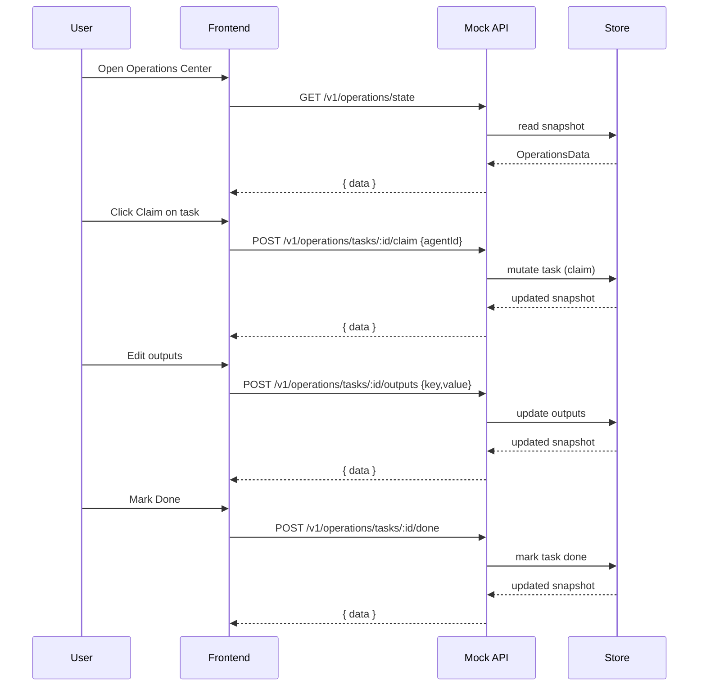
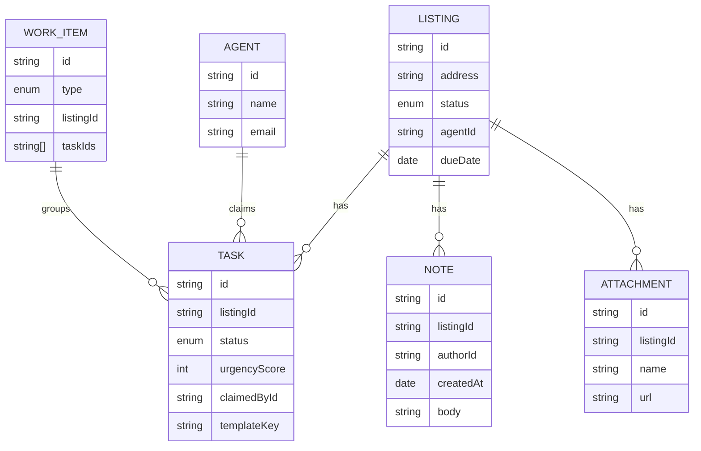

## Architecture

This doc explains what runs where, how data moves, and what each piece does.

### Repo inventory

The table below is derived from the repository analysis. Paths are repo-relative.

| Path | Role/Purpose | Key Dependencies | Consumed By | Exposes |
| --- | --- | --- | --- | --- |
| package.json | Scripts, deps, dev tooling | vite, react, tailwindcss, typescript, eslint | Devs, build | npm scripts (dev, build, preview, mock-server) |
| vite.config.ts | Vite config (React SWC, aliases, server port) | @vitejs/plugin-react-swc, lovable-tagger | Vite | Alias @ to src; server host :: port 8080 |
| tsconfig.json | TS base paths and options | TypeScript | TS compiler | Path alias @/* to src/* |
| tsconfig.app.json | TS app config | TypeScript | App build | JSX react-jsx, bundler resolution |
| tsconfig.node.json | TS node config for tooling | TypeScript | Node tooling | Strict true for vite.config.ts |
| eslint.config.js | ESLint config | @eslint/js, typescript-eslint | Devs | Lint rules |
| postcss.config.js | PostCSS config | tailwindcss, autoprefixer | Build | Tailwind processing |
| tailwind.config.ts | Tailwind theme and content | tailwindcss-animate | Build | CSS tokens/classes |
| README.md | Project readme and API endpoints list | — | Humans | How to run dev + mock API |
| src/main.tsx | React bootstrap | react-dom | Browser | Mounts App |
| src/App.tsx | Routing, providers | react-router-dom, @tanstack/react-query | Browser | Routes and providers |
| src/pages/Index.tsx | Root route alias | — | Router | Loads OperationsCenterPage |
| src/pages/OperationsCenterPage.tsx | Page shell for OC | OperationsCenter component | Router | Page layout |
| src/pages/ArchivePage.tsx | Archive listings/strays view | OperationsProvider, modals | Router | Archive UI |
| src/components/auth/AuthContext.tsx | Demo auth context | localStorage | App | signInWithGoogle/signOut; user state |
| src/components/auth/GoogleSignIn.tsx | Demo sign-in card | AuthContext, UI libs | App | Sign-in UI |
| src/components/operations-center/api.ts | API client | fetch, import.meta.env | Operations state | REST calls returning OperationsData |
| src/components/operations-center/state.tsx | Operations context/provider | api.ts | OC views | data + actions |
| src/components/operations-center/types.ts | Shared types | — | All OC files | TS types |
| src/components/operations-center/OperationsCenter.tsx | Tabs shell, modals | state.tsx | OC page | Tabs and modals |
| src/components/operations-center/Board.tsx | Generic DnD board | @hello-pangea/dnd | Views | Board component |
| src/components/operations-center/views/ListingsView.tsx | Listings board/queue switcher | ListingsBoard, ListingsQueue | OC shell | View switch |
| src/components/operations-center/views/ListingsBoard.tsx | Kanban for listings | Board, validation | Listings UI | Drag/drop; Archive link |
| src/components/operations-center/views/ListingsQueue.tsx | Queue of listing tasks | claim logic | Listings UI | Claim tasks by listing |
| src/components/operations-center/views/ListingTasksModal.tsx | Modal with tasks for listing | ops actions | Listings UI | Task list + claim/unclaim |
| src/components/operations-center/views/TaskDetail.tsx | Task detail card | SimpleTaskForm | Modals | Claim/Unclaim/Done + outputs |
| src/components/operations-center/views/TaskDetailModal.tsx | Modal wrapper for TaskDetail | Dialog UI | Modals | Modal container |
| src/components/operations-center/views/MyTasksView.tsx | My tasks grouped, board/queue | ops actions | My Tasks | Manage my tasks |
| src/components/operations-center/views/MyTasksBoard.tsx | My tasks kanban | Board | My Tasks | Drag to change status |
| src/components/operations-center/views/StrayQueuesBoard.tsx | Admin/Marketing strays | claim logic | Strays | Two-column list |
| src/components/operations-center/SimpleTaskForm.tsx | Basic template-driven form | templates.ts, useOperations | TaskDetail | Render outputs + notes |
| src/components/operations-center/templates.ts | FE template ingestion | shared/category-templates.json | SimpleTaskForm | Template registry & instantiation |
| src/components/operations-center/validation.ts | Completeness helpers | templates.ts | UI badges | getListingCompleteness |
| src/lib/tasks/core.ts | Tasks & Screens type system | — | TaskRenderer, definitions | defineTask, bind, path, checks |
| src/lib/tasks/registry.tsx | Component/data/action registries | React context | TaskRenderer | get/register providers |
| src/lib/tasks/defaultComponents.tsx | Default input/output components | shadcn/ui | TaskRenderer | Registered renderers |
| src/lib/tasks/TaskRenderer.tsx | Renderer engine | react-hook-form, registry | TaskDetail (future) | Renders components, actions |
| src/lib/tasks/definitions.ts | Build DefinedTask from templates | core.ts, templates.ts | TaskDetail (future) | taskDefinitions map |
| mock-server/server.js | Express mock API routes | express, cors | Frontend API | REST endpoints |
| mock-server/operations-store.js | Mock state mutations | operations-data.js | server.js | Store functions |
| mock-server/operations-data.js | Seed dataset | category-templates.js | operations-store.js | Initial OperationsData |
| mock-server/category-templates.js | Instantiate tasks from templates | shared/category-templates.json | operations-data.js | Task generation |
| shared/category-templates.json | Templates data | — | FE/BE | Template arrays by category |
| docs/backend/technical-design.md | Backend design | — | Humans | AWS plan and API contract |
| docs/project-overview.md | Project overview | — | Humans | How pieces fit together |

### Mental model (3–5 ideas)

- The frontend renders a snapshot of operations data (listings, tasks, etc.).
- The mock API returns a full snapshot on each request and mutates an in-memory store.
- UI interactions send small POSTs (claim, outputs, done) and replace the snapshot.
- Task screens are described by data (components, data sources, transforms, actions).

### Data flow

1. Frontend boots and fetches `GET /v1/operations/state`.
2. User interacts (claim a task, edit outputs, mark done).
3. Frontend POSTs to mock API; server mutates store; server returns a new snapshot.
4. Provider updates React state; components re-render.

### Control flow

- The `OperationsProvider` wraps the app and exposes data plus action methods.
- Views call actions; actions call `api.ts`; `api.ts` calls the mock API.
- The `TaskRenderer` renders a task screen from a definition using registries.

### Runtime ports & processes

| Service | Command | Port | Notes |
| --- | --- | --- | --- |
| Frontend (dev) | `npm run dev` | 5173 (default) | Vite dev server |
| Frontend (preview) | `npm run preview` | 8080 (often) | As configured by Vite |
| Mock API | `npm run mock-server` | 8080 | Express server |

### Diagrams

Component view:

```mermaid
flowchart LR
  Browser[React Frontend (Vite)] -->|GET /v1/operations/state| MockAPI[[Express Mock API]]
  Browser --> UIComp[Tasks & Screens Renderer]
  UIComp --> Templates[[shared/category-templates.json]]
  MockAPI --> Store[(In-memory Store)]
  Browser -->|POST /v1/operations/tasks/:id/claim| MockAPI
  Browser -->|POST /v1/operations/tasks/:id/outputs| MockAPI
  Browser -->|POST /v1/operations/tasks/:id/done| MockAPI
```

Sequence (claim, edit outputs, mark done):



Data model (simplified):



See also: [diagrams directory](./diagrams/).
