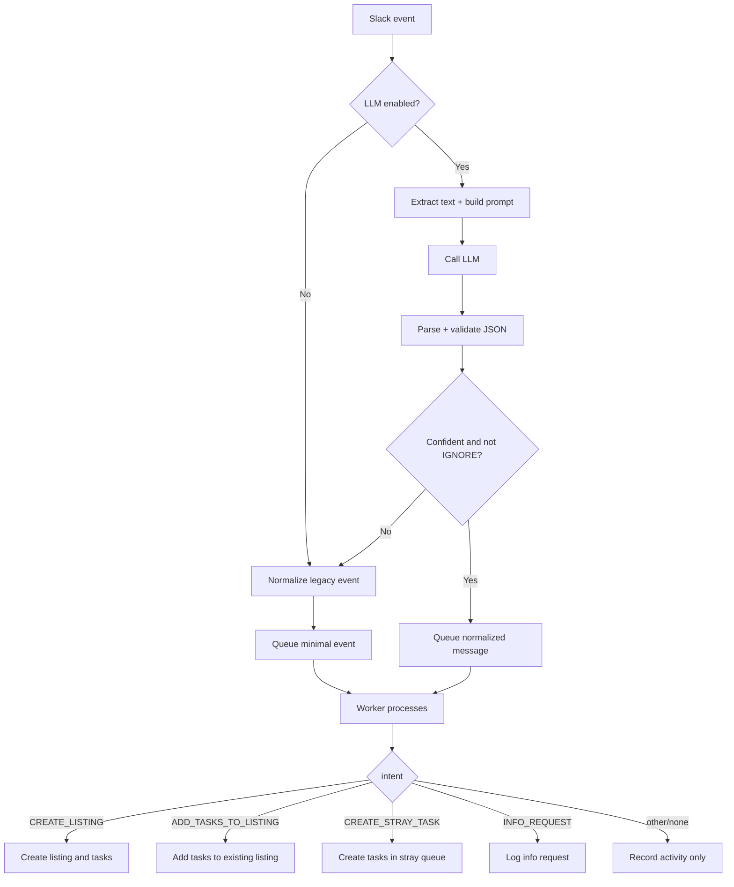
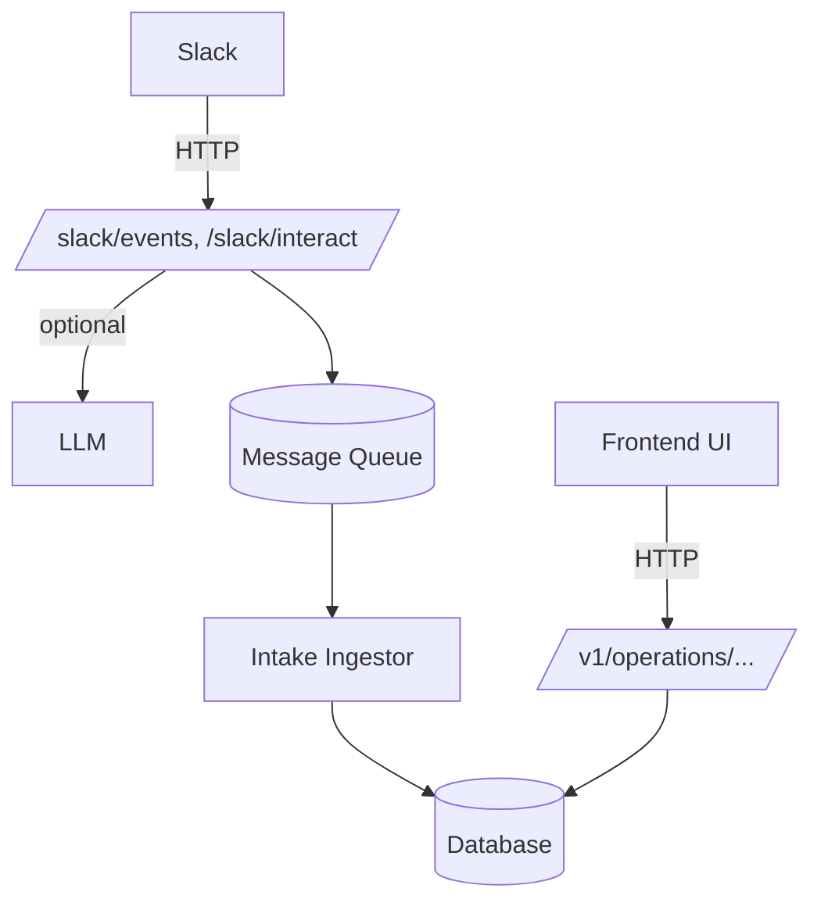

## Slack → LLM → Frontend: how information flows

This document explains, in simple terms, how a message posted in Slack turns into listings and tasks the web app can show. It also includes Mermaid diagrams you can paste into a Markdown renderer that supports them.

### The big picture

- A message arrives from Slack at the backend.
- The backend quickly acknowledges it to Slack (so Slack doesn’t retry).
- The backend optionally asks an LLM to turn the message into a small JSON plan.
- That JSON plan is put on a message queue for background processing.
- A background worker reads the plan and writes new listings and tasks to the database.
- The frontend calls simple REST endpoints to fetch listings, tasks, notes, and history, and renders the boards and queues.

## End‑to‑end sequence

```mermaid
sequenceDiagram
    autonumber
    actor User as Slack user
    participant Slack as Slack
    participant API as Backend (/slack endpoints)
    participant LLM as LLM
    participant MQ as Message queue
    participant Worker as Intake worker
    participant DB as Database
    participant FE as Frontend (Operations UI)

    User->>Slack: Mentions the app / posts a message
    Slack->>API: POST /slack/events (or /slack/interact)
    API-->>Slack: 200 OK (quick ack)
    API->>API: Check Slack signature
    API->>LLM: Build simple prompt and ask for JSON (optional)
    LLM-->>API: JSON with intent, tasks, listing info
    API->>MQ: Enqueue JSON as one message
    Worker->>MQ: Poll for messages
    MQ-->>Worker: Normalized message
    Worker->>DB: Create/Update listing and tasks; log activity
    FE->>API: GET listings, details, tasks
    API-->>FE: JSON data
    FE->>FE: Build state and render boards/queues

    alt LLM off or unsure
      API->>MQ: Enqueue a minimal event (still logged)
      Worker->>DB: Record an audit entry only (no changes)
    end
```

## What the LLM does (in plain English)

- The backend extracts a few simple fields from the Slack message: the text, the user, the channel, and a timestamp.
- It asks the LLM for a small JSON object that says what to do. We call this a “normalized intake” message.
- That JSON has an "intent" like:
  - CREATE_LISTING (make a new listing and tasks)
  - ADD_TASKS_TO_LISTING (add tasks to an existing listing)
  - CREATE_STRAY_TASK (create tasks that aren’t tied to a listing yet)
  - INFO_REQUEST (we need more info)
  - IGNORE (not actionable)
- If the LLM is disabled, unsure, or returns IGNORE/low confidence, we skip changes and just log the Slack event.

Example (what we aim for when the LLM is confident):

```json
{
  "schema_version": 1,
  "intent": "CREATE_LISTING",
  "idempotency_key": "sha1(C123:1700000000.0001)",
  "source": { "slack_user_id": "U123", "channel_id": "C123", "ts": "1700000000.0001" },
  "listing": { "type": "SALE", "address": "123 Main St" },
  "tasks": [ { "task_type": "BOOK_PHOTOS" } ],
  "meta": { "confidence": 0.9 }
}
```

If we take the legacy path (no LLM), we send a simpler shape that mainly captures who said what, where, and when. The worker records it as activity only.

```json
{
  "schema_version": 1,
  "source": "slack",
  "type": "message.channels",
  "channel_id": "C123",
  "user_id": "U123",
  "text": "hello",
  "ts": "1700000000.0001"
}
```

## What the worker does with the message

When the worker reads a message from the queue, it:

- Checks if we already handled it (to avoid processing the same message twice).
- Looks at the intent and applies changes:
  - CREATE_LISTING: make a listing and its tasks; log an audit entry
  - ADD_TASKS_TO_LISTING: add tasks to the right listing; log an audit entry
  - CREATE_STRAY_TASK: create tasks that live in the “stray” area; log an audit entry
  - INFO_REQUEST: just log that we need more details
  - Anything else: log that we ingested the event

## How the frontend gets the data

The UI doesn’t talk to Slack or the LLM. It only calls a few REST endpoints and builds a snapshot of the operation center state:

- `GET /v1/operations/listings` — listing summaries
- `GET /v1/operations/listings/:id/details` — details, notes, history, tasks (if available)
- `GET /v1/operations/tasks/:listingId` — task list per listing

The frontend file `packages/frontend/src/components/operations-center/api.ts` fetches those endpoints, merges the responses, and maps them into the types the boards and queues expect. That’s what powers screens like the listings board and the queue views.

## Decision flow (LLM on/off, confidence, and intents)



## Components map (who talks to whom)



## Where this lives in the code

- Slack HTTP endpoints: `src/routes/slack.ts` (verifies Slack signatures, acks fast, kicks off processing)
- LLM classifier: `src/services/llmClassifier.ts` (extracts text, calls the LLM, validates JSON, enqueues)
- Legacy normalizer + enqueue: `src/services/intakeClassifier.ts`
- Intake worker that writes to DB: `src/services/intakeIngestor.ts`
- Frontend aggregator: `packages/frontend/src/components/operations-center/api.ts`
- Read models (REST):
  - Listings: `src/routes/listings.ts`
  - Tasks: `src/routes/tasks.ts`

## Notes and settings

- Turn LLM step on/off: `USE_LLM_CLASSIFIER` (true/false)
- Minimum confidence to accept an LLM plan: `LLM_CONFIDENCE_MIN` (default 0.6)
- LLM timeout: `LLM_TIMEOUT_MS`
- Message queue URL: `INTAKE_QUEUE_URL`
- Frontend API base: `VITE_OPERATIONS_API_URL` (falls back to `/v1`)

That’s it: Slack in, quick ack, optional LLM plan, queued processing, DB writes, and simple GETs that the UI renders.


