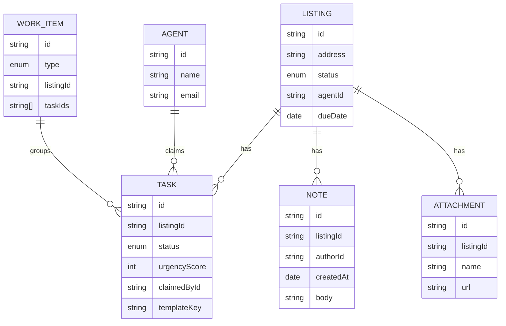

## Data model (Mermaid ER diagram)

```mermaid
erDiagram
  LISTING ||--o{ TASK : has
  LISTING ||--o{ NOTE : has
  LISTING ||--o{ ATTACHMENT : has
  WORK_ITEM ||--o{ TASK : groups
  AGENT ||--o{ TASK : claims
  LISTING {
    string id
    string address
    enum status
    string agentId
    date dueDate
  }
  TASK {
    string id
    string listingId
    enum status
    int urgencyScore
    string claimedById
    string templateKey
  }
  NOTE {
    string id
    string listingId
    string authorId
    date createdAt
    string body
  }
  ATTACHMENT {
    string id
    string listingId
    string name
    string url
  }
  WORK_ITEM {
    string id
    enum type
    string listingId
    string[] taskIds
  }
  AGENT {
    string id
    string name
    string email
  }
```
