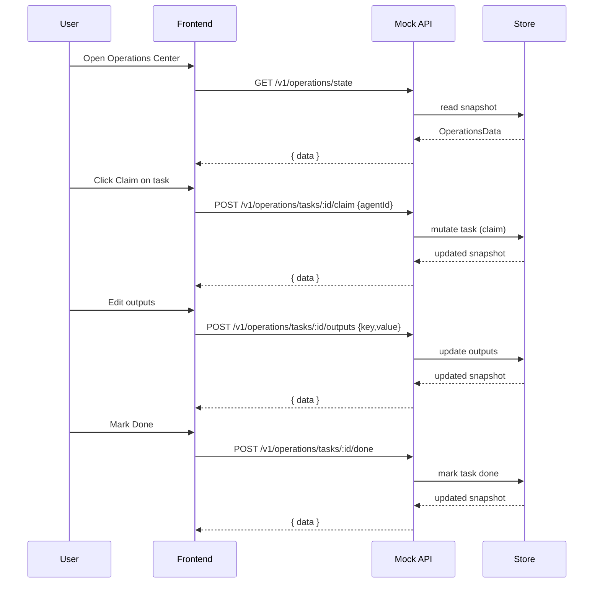

## Sequence diagram (Mermaid)

```mermaid
sequenceDiagram
  participant U as User
  participant FE as Frontend
  participant API as Mock API
  participant ST as Store
  U->>FE: Open Operations Center
  FE->>API: GET /v1/operations/state
  API->>ST: read snapshot
  ST-->>API: OperationsData
  API-->>FE: { data }
  U->>FE: Click Claim on task
  FE->>API: POST /v1/operations/tasks/:id/claim {agentId}
  API->>ST: mutate task (claim)
  ST-->>API: updated snapshot
  API-->>FE: { data }
  U->>FE: Edit outputs
  FE->>API: POST /v1/operations/tasks/:id/outputs {key,value}
  API->>ST: update outputs
  ST-->>API: updated snapshot
  API-->>FE: { data }
  U->>FE: Mark Done
  FE->>API: POST /v1/operations/tasks/:id/done
  API->>ST: mark task done
  ST-->>API: updated snapshot
  API-->>FE: { data }
```
